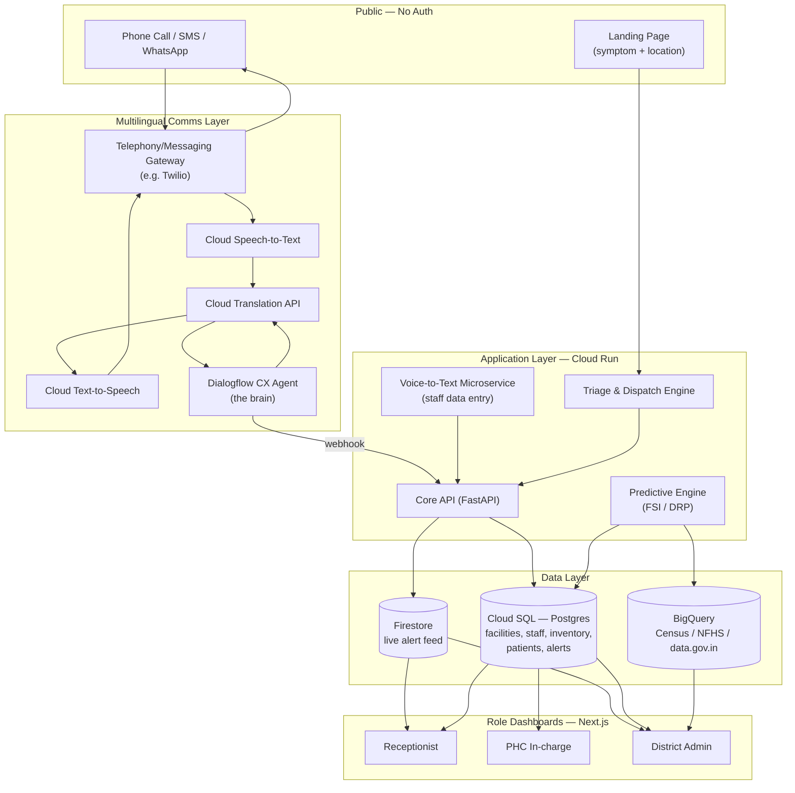

# PulseDesk — End-to-End Platform Guide

---

## 0. Naming note

A quick check turned up two active, unrelated uses of "Healthify":

1. **HealthifyMe's consumer app**, sold under the exact name **Healthify** on the App Store and Play Store (40M+ users, India-based).
2. A separate **B2B "Healthify"** — a care-coordination platform for healthcare and community services.

Both sit close enough to your product (health tech, India, care coordination) that reusing the name is risky. I'm not a trademark lawyer, so treat this as a flag to check with one — not a legal verdict. Everywhere in this guide and in `prompt.md`, I've used **"PulseDesk"** as the working name (*swasthya* = health, the standard Hindi/Sanskrit term recognized across most Indian languages; *grid* = the network of facilities, redistribution, and live alerts the platform coordinates). A quick check turned up no major existing platform under this exact name — the closest neighbors are West Bengal's unrelated "Swasthya Sathi" insurance scheme and the Ministry of Ayush's "Ayush Grid," neither a real collision — but that's a sanity check, not full clearance. It's a single find-and-replace across both files if you settle on something else; nothing in the architecture depends on the name.

---

## 1. What you're building

PulseDesk is one platform with **two front doors and three internal dashboards**:

- **Front door 1 — Public Landing Page:** anyone (patient, bystander, family member) describes an illness/symptom and shares a location. If it reads as an emergency, the system finds the nearest capable facility/ambulance and fires a dispatch alert.
- **Front door 2 — Multilingual Voice/Call/SMS/WhatsApp Triage:** the same intake, but for people who'd rather speak in their own language than type into a web form. This is the Dialogflow CX + Speech-to-Text + Translation + Text-to-Speech pipeline you described.
- **Internal dashboards** for **Receptionist**, **PHC In-charge**, and **District Administrator** — each scoped to the data and actions relevant to that role, all sitting on top of one shared backend and one shared predictive engine (the FSI/DRP formulas and data.gov.in/Census/NFHS integration from `database.md`).
- **Field-staff voice input** (from `Context.md`) — the same Speech-to-Text engine, reused so a receptionist or PHC in-charge can speak an inventory update or attendance log instead of typing it.

Everything below is organized so that each module maps cleanly onto a stage in `prompt.md`.

---

## 2. User roles & access matrix

| Role | Auth required? | Primary surface | Core capabilities | Data scope |
|---|---|---|---|---|
| **Patient / Public** | No | Landing page, SMS, WhatsApp, voice call | Describe symptoms, share location, receive triage guidance, receive ambulance/dispatch confirmation | None stored against an identity beyond the session needed to complete dispatch |
| **Receptionist** | Yes (facility-scoped login) | Receptionist Dashboard | Log walk-in patients, log OPD footfall, view/acknowledge incoming dispatch alerts for their facility, voice-log quick updates, view bed/test availability for their own facility | Single facility |
| **PHC In-charge** | Yes (facility-admin login) | PHC In-charge Dashboard | Everything a receptionist sees, plus: inventory management (stock levels, DRP alerts), doctor attendance vs. sanctioned strength, facility-level FSI, request resource redistribution | Single facility (full read/write) |
| **District Administrator** | Yes (district-admin login) | District Dashboard | Cross-facility FSI heatmap, underperforming-facility flags, redistribution approvals, ambulance fleet overview, attendance-deviation reporting, NFHS/Census/data.gov.in benchmark views | All facilities in district (read; write only on redistribution/escalation actions) |
| **System (service accounts)** | API key / service identity | Dialogflow CX webhook, ETL jobs | Write transcribed intents, write predictive-engine outputs, no UI | Scoped per integration |

Role is enforced server-side via RBAC claims (see §9), never inferred from which dashboard URL is loaded.

---

## 3. High-level architecture



**Why this shape:**
- One **Core API** is the single source of truth; the comms layer and the three dashboards are all just clients of it. This avoids three separate backends drifting apart.
- **Firestore** carries only the *live, short-lived* alert feed (ambulance dispatches, new stock-outs) so dashboards can subscribe in real time without polling Postgres.
- **BigQuery** is where the slow-moving reference datasets (Census, NFHS, data.gov.in) live, because they're bulk/analytical, not transactional — querying them inside the OLTP database would be the wrong tool for the job.

---

## 4. Module breakdown

### 4.1 Multilingual Patient Intake (voice/SMS/WhatsApp/call)

Maps directly to the workflow you described:

| Step | Service | Notes |
|---|---|---|
| Patient calls/texts in native language | Telephony/messaging gateway (Twilio Voice + Twilio's WhatsApp/SMS API integrate natively with Dialogflow CX) | Single gateway handles all three channels so the rest of the pipeline doesn't care which channel originated the message |
| Voice → text | Cloud Speech-to-Text | Same underlying engine as the field-staff Voice-to-Text API in §4.2 — one shared STT client library, two different callers |
| Native language → English | Cloud Translation API | Runs only on the voice/call path; if the patient typed in English already, skip |
| Intent & triage decision | Dialogflow CX | Classifies symptom severity (emergency vs. non-emergency), extracts entities (symptom, duration, see Context.md's "specialized terms" requirement for medicine/medical vocabulary) |
| English → native language | Cloud Translation API | Translates the CX response back |
| Text → voice (call channel only) | Cloud Text-to-Speech | Skipped for SMS/WhatsApp, which stay as text |
| Response delivered | Telephony/messaging gateway | Confirmation message, triage advice, or "ambulance dispatched, ETA X" |

Dialogflow CX's fulfillment webhook calls into the **Core API**, which is what actually runs triage-severity logic and (if needed) the dispatch engine in §4.3 — Dialogflow CX should stay a conversation manager, not where business logic lives.

### 4.2 Voice-to-Text API for field staff (from `Context.md`)

This is the existing spec you uploaded, reused as-is for internal staff (receptionist/PHC in-charge), not just patients:

```http
POST /api/v1/voice/transcribe
Content-Type: multipart/form-data
Authorization: Bearer <token>
```

Returns `{ transcribed_text, confidence_score, detected_language_code }` as specified. The one addition needed for this platform: after transcription, the **Core API** runs a lightweight intent router (regex/keyword first pass; Dialogflow CX intent classification if you want it more robust later) to decide *what kind* of update it is — stock update, footfall count, attendance log — and writes to the matching table. Example: "Paracetamol stock khatam ho gaya hai" → transcribed → matched against `inventory_items.name` → stock flagged as zero → DRP recalculated.

### 4.3 Public Landing Page & Ambulance Dispatch

1. Patient enters illness/symptom (free text) and location (browser geolocation or typed address).
2. **Triage & Dispatch Engine** scores severity. For an MVP, a simple keyword/symptom-to-severity lookup table is enough; this can later be swapped for the same Dialogflow CX intent classifier used in §4.1 so both entry points share one triage brain.
3. If flagged as an emergency: query nearby facilities (Google Maps Distance Matrix or Directions API) for the nearest one with available beds/ambulance capacity (from `facilities.available_beds`, kept current by the PHC In-charge dashboard).
4. Dispatch record created → pushed to Firestore → Receptionist dashboard of the matched facility gets a real-time alert; if no facility within range has capacity, escalate directly to the District Administrator dashboard.
5. Patient receives a confirmation (SMS/push) with facility name and ETA.

### 4.4 Predictive Analytics Engine (from `database.md`)

Implements the two formulas exactly as specified:

**Facility Stress Index (FSI):**

$$\text{FSI} = \frac{\text{Real-time Daily Footfall}}{\text{Census Catchment Population} \times \text{Available Beds Baseline}}$$

**Dynamic Reorder Point (DRP):**

$$\text{DRP} = (\text{Average Daily Burn Rate} \times \text{Supply Lead Time}) + \text{NFHS Seasonal Vector Weight}$$

A nightly ETL job pulls Census/NFHS/data.gov.in extracts into BigQuery, keyed by district code. The Predictive Engine joins that against live Postgres data (footfall, stock burn rate) to compute FSI per facility and DRP per medicine, writing results back into Postgres for the dashboards to read cheaply.

### 4.5 Resource Redistribution & Escalation

When Facility A's FSI is high and Facility B's is low (within a configurable radius), the engine raises a **redistribution suggestion** — surfaced to the District Administrator for approval, not auto-executed, since moving patients/resources is a human call. Similarly, when a facility's metrics sit below `data.gov.in` infrastructure baselines for a sustained window, an **Underperforming Facility** flag posts to the District dashboard.

---

## 5. Dashboards

### Receptionist Dashboard
- Patient queue / walk-in registration
- Incoming ambulance/dispatch alerts for this facility (acknowledge, mark arrived)
- Quick voice-log button (calls the Voice-to-Text API) for footfall count
- Read-only view of this facility's bed/test availability

### PHC In-charge Dashboard
- Everything in Receptionist, plus:
- Inventory table with current stock, burn rate, DRP-driven reorder warnings
- Doctor/staff attendance log vs. sanctioned strength (NHP baseline)
- Facility FSI gauge
- "Request redistribution" action (sends a request to District Admin)
- Voice-log button for stock updates, attendance

### District Administrator Dashboard
- District-wide FSI heatmap across facilities
- Underperforming Facility flags, with drill-down to the contributing metric
- Pending redistribution requests (approve/reject)
- Attendance-deviation report across all facilities
- Ambulance fleet status (in transit / available / at facility)
- NFHS/Census/data.gov.in benchmark comparison views

---

## 6. Data model (core tables)

| Table | Key fields | Notes |
|---|---|---|
| `facilities` | `id`, `district_code`, `name`, `type` (PHC/CHC), `lat`, `lng`, `sanctioned_beds`, `available_beds`, `sanctioned_staff` | District code is the join key into Census/NFHS/data.gov.in reference data |
| `staff` | `id`, `facility_id`, `role`, `name` | |
| `attendance_logs` | `staff_id`, `date`, `status` | Compared against `sanctioned_staff` for deviation flags |
| `inventory_items` | `id`, `facility_id`, `medicine_name`, `current_stock`, `avg_daily_burn_rate`, `supply_lead_time`, `drp_value` | |
| `footfall_logs` | `facility_id`, `date`, `count` | Feeds FSI |
| `patient_sessions` | `id`, `channel` (web/sms/whatsapp/call), `raw_text`, `language_code`, `confidence_score`, `severity`, `created_at` | Output of both intake paths (§4.1, §4.3) |
| `dispatches` | `id`, `patient_session_id`, `facility_id`, `status` (pending/enroute/arrived), `lat`, `lng`, `eta` | |
| `alerts` | `id`, `type` (stock-out / underperforming / surge / redistribution), `facility_id`, `status`, `created_at` | Mirrored into Firestore for live push |
| `census_reference`, `nfhs_reference`, `datagovin_reference` | `district_code` + dataset-specific columns | Loaded into BigQuery, not Postgres, via ETL |

---

## 7. Core API surface

| Endpoint | Method | Used by |
|---|---|---|
| `/api/v1/voice/transcribe` | POST | Staff voice-log (§4.2), reused internally by the Dialogflow CX webhook for the call channel |
| `/api/v1/intake` | POST | Landing page text submission (§4.3) |
| `/api/v1/dispatch/{id}` | GET/PATCH | Receptionist alert acknowledgment, status updates |
| `/api/v1/inventory/{facility_id}` | GET/POST | PHC In-charge inventory CRUD |
| `/api/v1/attendance/{facility_id}` | GET/POST | PHC In-charge attendance log |
| `/api/v1/fsi/{facility_id}` | GET | Dashboards (single-facility) |
| `/api/v1/fsi/district/{district_code}` | GET | District dashboard (aggregate) |
| `/api/v1/redistribution` | GET/POST/PATCH | Request, list, approve/reject |
| `/api/v1/alerts` | GET (realtime via Firestore listener) | All dashboards |
| `/webhook/dialogflow` | POST | Dialogflow CX fulfillment only |

---

## 8. Tech stack summary

| Layer | Choice | Why |
|---|---|---|
| Frontend (all 3 dashboards + landing page) | Next.js + TypeScript + Tailwind CSS | One framework, role-based routing, fast to ship on Cloud Run/Firebase Hosting |
| Backend | FastAPI (Python) | Matches `Context.md`'s own suggestion; async-friendly for audio processing |
| Conversational AI | Dialogflow CX | Per your spec |
| Speech | Cloud Speech-to-Text / Cloud Text-to-Speech | Per your spec; same engine serves both patient and staff paths |
| Translation | Cloud Translation API | Per your spec |
| Telephony/messaging gateway | Twilio (Voice + WhatsApp + SMS), integrates natively with Dialogflow CX | Avoids building call/SMS infra from scratch |
| Primary database | Cloud SQL (Postgres) | Transactional data: facilities, staff, inventory, dispatches |
| Analytical store | BigQuery | Census/NFHS/data.gov.in bulk reference data |
| Real-time layer | Firestore | Live alert feed to dashboards |
| Maps/geolocation | Google Maps Platform (Places, Distance Matrix) | Nearest-facility matching for dispatch |
| Auth | Firebase Auth / GCP Identity Platform with custom claims | RBAC per §2 |
| Hosting | Cloud Run (API, services) + Firebase Hosting (frontend) | Matches the Google Cloud-centric stack you specified |

---

## 9. Security, privacy & compliance

- **RBAC enforced server-side** on every API call via custom auth claims (`role`, `facility_id`, `district_code`) — never trust the frontend route.
- **Voice data consent:** since this records patients' voices, the call-channel flow should include a brief recorded/spoken consent notice before transcription begins, per applicable Indian data-protection rules (India's **DPDP Act, 2023**, plus any health-data-specific guidance in force at the time you build — check current requirements, as this area moves).
- **Data residency:** prefer GCP's Mumbai (`asia-south1`) region for Postgres/Cloud Run/Firestore to keep health data in-country.
- **Minimize identity in the public landing-page flow** — store only what's needed to complete dispatch; don't require account creation for patients.
- **Anonymize before analytics:** when patient session data feeds into FSI/DRP aggregates, strip anything identifying — the predictive engine only needs counts and categories, not names.

---

## 10. Phased rollout plan

| Phase | Scope |
|---|---|
| **MVP** | Landing page intake + dispatch engine, Receptionist dashboard, Postgres data model, Voice-to-Text API (staff only) |
| **V1** | Add PHC In-charge dashboard, FSI/DRP predictive engine, Census/NFHS/data.gov.in ETL into BigQuery |
| **V2** | Add District Administrator dashboard, redistribution workflow, underperforming-facility flags |
| **V3** | Add full Dialogflow CX + STT + Translation + TTS multilingual call/SMS/WhatsApp pipeline |

This ordering front-loads the parts that prove out the core data model and dispatch logic before layering on the more complex multilingual conversational pipeline — but `prompt.md` is written so you can reorder or run stages in parallel via Antigravity's Agent Manager if you'd rather build breadth-first.

---

## 11. Using this guide with `prompt.md`

`prompt.md` breaks this exact architecture into stage-by-stage prompts written for **Google Antigravity**. Each stage references the tables, endpoints, and module names defined above, so keep this file open (or attached as project context in Antigravity) while working through the stages.
