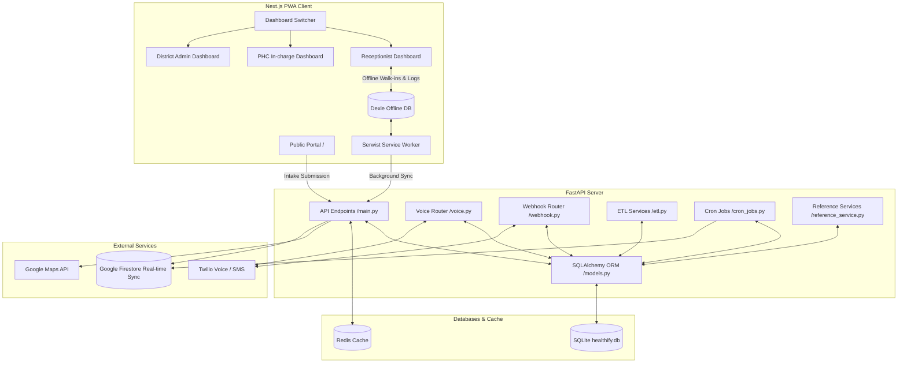
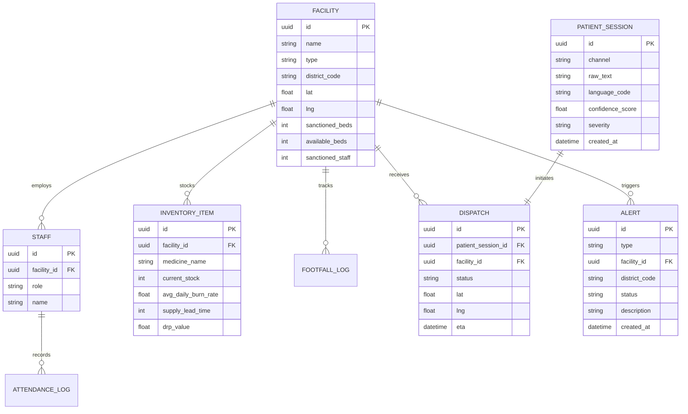

# PulseDesk Code Review Graph

This document serves as a visual guide and code review graph for **PulseDesk** (formerly known as Swasthya Grid). It outlines the architecture, component interactions, database schema, and data flows to facilitate codebase reviews.

## System Architecture Overview

PulseDesk is an integrated, offline-first healthcare management and emergency dispatch system. The system comprises a PWA frontend built with Next.js and a FastAPI backend with background task capabilities and third-party integrations.

---

## Component Details & File Mapping

### 1. Frontend Client (`/frontend`)
*   **Public Intake Portal** ([frontend/src/app/page.tsx](file:///D:/WebDevProject/PulseDesk/frontend/src/app/page.tsx)):
    *   *Features:* Symptom submission, GPS or preset manual geolocation.
    *   *Backend Call:* POST `/api/v1/intake`.
*   **Dashboard Switcher** ([frontend/src/app/DashboardSwitcher.tsx](file:///D:/WebDevProject/PulseDesk/frontend/src/app/DashboardSwitcher.tsx)):
    *   *Features:* Allows switching roles between Receptionist, PHC In-charge, and District Admin.
*   **Receptionist Dashboard** ([frontend/src/app/receptionist/page.tsx](file:///D:/WebDevProject/PulseDesk/frontend/src/app/receptionist/page.tsx)):
    *   *Features:* Patient registration, local walk-in log management, offline capability using Dexie.js.
*   **PHC In-charge Dashboard** ([frontend/src/app/phc-incharge/page.tsx](file:///D:/WebDevProject/PulseDesk/frontend/src/app/phc-incharge/page.tsx)):
    *   *Features:* Inventory tracking, daily footfall monitoring, bed management, staff attendance marking.
*   **District Admin Dashboard** ([frontend/src/app/district-admin/page.tsx](file:///D:/WebDevProject/PulseDesk/frontend/src/app/district-admin/page.tsx)):
    *   *Features:* District-wide KPI maps, resource redistribution tools, alert monitors.
*   **Service Worker & Offline Storage** ([frontend/src/lib/db.ts](file:///D:/WebDevProject/PulseDesk/frontend/src/lib/db.ts) & [frontend/src/app/sw.ts](file:///D:/WebDevProject/PulseDesk/frontend/src/app/sw.ts)):
    *   Uses Dexie to queue local transactions (walk-ins, footfalls) and Serwist for service worker caching.

### 2. Backend Server (`/backend`)
*   **App Core** ([backend/main.py](file:///D:/WebDevProject/PulseDesk/backend/main.py)):
    *   Configures FastAPI, registers CORS, imports routes, and exposes main API endpoints:
        *   `POST /api/v1/intake` - Classifies severities and queries distances to assign dispatches.
        *   `GET /api/v1/facilities` - Fetches all seeded facilities.
*   **Models & ORM** ([backend/models.py](file:///D:/WebDevProject/PulseDesk/backend/models.py)):
    *   Maps SQLAlchemy classes to database tables:
        *   `Facility`, `Staff`, `AttendanceLog`, `InventoryItem`, `FootfallLog`, `PatientSession`, `Dispatch`, `Alert`.
        *   Reference tables: `CensusReference`, `NFHSReference`, `DataGovInReference`.
*   **Voice Interface** ([backend/voice.py](file:///D:/WebDevProject/PulseDesk/backend/voice.py)):
    *   Handles interactive voice response (IVR) triage calls via Twilio.
*   **Webhook Interface** ([backend/webhook.py](file:///D:/WebDevProject/PulseDesk/backend/webhook.py)):
    *   Handles webhooks for Twilio messaging and callback confirmations.
*   **ETL Pipeline** ([backend/etl.py](file:///D:/WebDevProject/PulseDesk/backend/etl.py)):
    *   Consolidates demographic, geographic, and facility statistics.
*   **Cron Jobs** ([backend/cron_jobs.py](file:///D:/WebDevProject/PulseDesk/backend/cron_jobs.py)):
    *   Performs regular checkups (e.g. bed surges, stock-out detection, redistribution alerts).

---

## Database Relationships

The following entity-relationship diagram shows the relational schema in SQLite (`healthify.db`):

